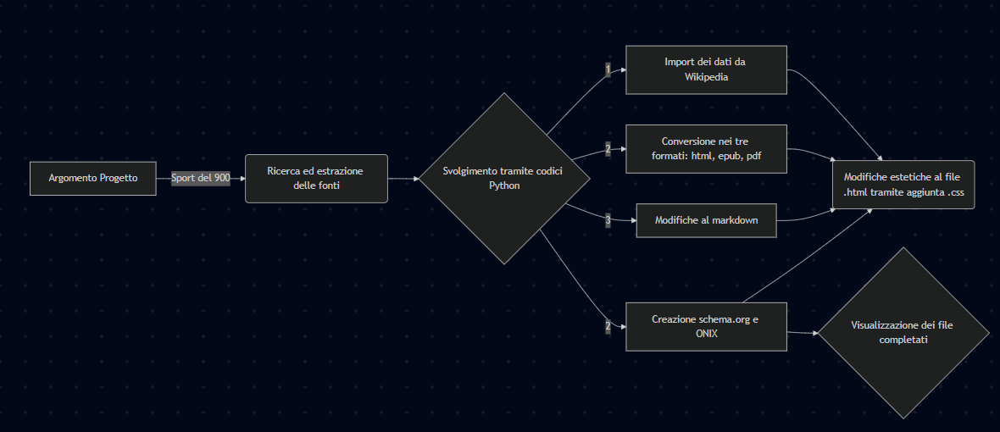

# Relazione del progetto d’esame di Editoria Digitale
**Esposito Andrea – 20965A**  
**a.a. 2024/2025**

## Titolo Progetto d’Esame
**I Giochi della II Olimpiade – Parigi 1900**  
_Un progetto editoriale digitale per raccontare la storia dello sport_

## Introduzione

Il presente progetto si propone di valorizzare uno degli eventi più emblematici – quanto trascurati – della storia sportiva moderna: **i Giochi della II Olimpiade**, tenutisi a **Parigi nel 1900**, in concomitanza con l’Esposizione Universale. L'intento non è solo quello di restituire una narrazione storica, ma di farlo **attraverso un prodotto editoriale digitale**, concepito per essere **fruibile, accessibile e multi-piattaforma**.

A partire dall’analisi di fonti primarie e secondarie, il contenuto è stato rielaborato con una struttura narrativa che guida il lettore dalla cornice storica alle discipline sportive, dalle controversie organizzative fino all’eredità culturale lasciata da quell’edizione. Il progetto non si limita a una riproposizione di contenuti, ma mira a essere un **caso di studio applicato di editoria digitale**, utilizzando strumenti e tecnologie che permettono di produrre **formati multipli (PDF, ePub, WebBook)** partendo da un’unica fonte strutturata.

## Ideazione

### Tema

Il tema scelto, “**I Giochi Olimpici di Parigi 1900: sport, storia e comunicazione**”, offre un’opportunità unica per **intrecciare narrazione storica, riflessione culturale e innovazione documentale**.  
L’edizione del 1900 rappresenta una delle più particolari nella storia delle Olimpiadi: la prima a includere donne, caratterizzata da discipline oggi scomparse e da una gestione organizzativa confusa.  
Attraverso il racconto di questi aspetti, il progetto restituisce la complessità storica del contesto sportivo e istituzionale dell’epoca.

### Destinatari

Il progetto è pensato per una varietà di pubblici. Da un lato, si rivolge a studenti e docenti di storia dello sport e comunicazione, offrendo loro uno strumento di studio accademico; dall’altro, è pensato per appassionati di Olimpiadi e cultura sportiva che possano trovare nel progetto un approfondimento sull'argomento. Inoltre, il contenuto si propone come risorsa utile per istituzioni accademiche e museali, con l'intento di promuovere una maggiore conoscenza storica e culturale. Gli scenari d'uso includono consultazioni accademiche tramite PDF, letture informali su tablet o eReader e navigazione online attraverso il formato WebBook.

## Modello di fruizione 

Il progetto mira a offrire contenuti chiari, accessibili e compatibili con diversi dispositivi, sia online che offline. I requisiti di accettazione includono: leggibilità, navigabilità, compatibilità multipiattaforma e aderenza agli standard aperti.

Il pubblico di riferimento — studenti, docenti e appassionati di storia dello sport — viene guidato da un modello di lettura flessibile, che consente sia una consultazione sequenziale che tematica. I formati scelti (PDF, ePub, HTML) rispondono a diverse esigenze di fruizione.

Sono stati adottati standard aperti come ePub 3.2, schema.org e ONIX, oltre a HTML5 e CSS3 per la versione web. La qualità tecnica è assicurata da strumenti come Pandoc per la conversione e ePubCheck per la validazione.

L’innovazione si riflette sia nei contenuti curati e strutturati tramite metadati, sia nel processo produttivo automatizzato con script Python, che migliora efficienza e coerenza tra i formati.

## Canali di distribuzione

Per quanto riguarda la distribuzione, il progetto sarà fruibile tramite diversi canali. Web accademico e repository universitari ospiteranno i contenuti, mentre i social media saranno utilizzati per la promozione. Il formato ePub sarà distribuito tramite eBook store e archivi open access, mentre il WebBook HTML5 sarà accessibile online, compatibile con browser per una lettura in modalità responsive.

Identità visiva: il progetto adotta un design sobrio e storico, con l’uso di font serif per evocare un tono editoriale, impaginazione con margini ampi e stili CSS coerenti. Saranno inclusi elementi visivi come citazioni storiche e immagini d’archivio, sempre rispettando le leggi sul copyright.

## Processo di Produzione

### Acquisizione dei contenuti

Il processo di produzione ha visto l'acquisizione di documenti storici ufficiali, archivi digitali come quelli di Europeana e CIO, testimonianze d'epoca, articoli storici e interviste. La redazione dei testi descrittivi è stata effettuata in modo autonomo, con un'accurata selezione e analisi delle fonti.
Il flusso di lavoro si è sviluppato attraverso diverse fasi: dalla raccolta e selezione dei contenuti, alla scrittura in Markdown dei testi, passando per la conversione automatica in vari formati tramite Pandoc, fino all’applicazione dello stile grafico in LaTeX e CSS. Il progetto ha incluso anche una fase di validazione per assicurare la compatibilità con standard di accessibilità e una verifica della qualità del contenuto e della sintassi, assicurandosi della compatibilità su diversi dispositivi.

## Gestione documentale 

Nel progetto di gestione documentale sono state impiegate diverse tecnologie e strumenti per automatizzare il flusso di lavoro e produrre l’elaborato finale in più formati. La prima fase ha previsto la ricerca e selezione delle fonti, reperite da siti e documenti online, con particolare attenzione a contenuti disponibili gratuitamente e pertinenti al tema trattato.

Successivamente, è stata avviata la fase operativa mediante l’uso di script Python dedicati. Con ImportoMetadatiWikipedia.py vengono estratti i metadati dalla pagina Wikipedia d'interesse. Il file generato viene poi processato con CreaSchemi.py, che permette di ottenere automaticamente schemi strutturati secondo i formati schema.org e ONIX.

Una volta creato il documento in Markdown, sono state applicate eventuali modifiche al testo. Tramite ConvertitoreFormati.py, il file Markdown viene poi convertito nei formati pdf, ePub e HTML, importando i metadati associati. Ogni formato può infine essere rifinito singolarmente: ad esempio, il file HTML viene personalizzato tramite CSS3 e JavaScript, mentre l’ePub è stato validato con ePubCheck.

A supporto dell’intero processo sono stati utilizzati anche Pandoc per la conversione dei formati, LaTeX per la composizione tipografica del PDF, e Git/GitHub per il versionamento e la gestione collaborativa dei file. Il risultato finale è un elaborato coerente e accessibile in più formati editoriali.

## Tecnologie utilizzate

Per realizzare il progetto sono state utilizzate diverse tecnologie e strumenti. A livello di linguaggi, si è partiti da Markdown, un linguaggio di markup semplice ed efficace per la documentazione di base, affiancato da HTML5 per la struttura delle pagine web e da CSS3 per la personalizzazione dell'estetica.

Per la gestione e conversione dei formati è stato utilizzato Pandoc, insieme a LaTeX per l’impaginazione avanzata e la produzione in PDF, ed ePubCheck per la validazione del formato ePub, uno degli output finali del progetto. Inoltre, sono stati impiegati Git e GitHub per il controllo di versione e la collaborazione sul codice.

| Formato  | Scenario 1                   | Scenario 2                   |
|----------|------------------------------|------------------------------|
| Markdown | 'Isn’t this fun?'            | 'Isn’t this fun?'            |
| XSLT     | "Isn’t this fun?"            | "Isn’t this fun?"            |
| ePub     | -- is en-dash, --- is em-dash| -- is en-dash, --- is em-dash|

## Esecuzione del flusso

Il flusso di lavoro è stato gestito in modo da garantire la ripetibilità del processo. I file sorgenti e le configurazioni sono stati documentati in un repository privato, e gli output sono stati generati in tre formati principali. Ogni fase del processo è stata automatizzata tramite script, rendendo l'intero flusso replicabile in futuro.

## Valutazione dei risultati raggiunti

Il progetto ha raggiunto risultati significativi. Innanzitutto, sono stati ridotti i tempi di impaginazione grazie all’automazione. Inoltre, la qualità editoriale è migliorata notevolmente, specialmente nei formati PDF ed ePub. L'accessibilità e la fruibilità del contenuto sono state ottimizzate, grazie alla creazione di un WebBook responsive. Infine, il progetto ha soddisfatto diverse necessità d'uso, spaziando dalla consultazione accademica alla lettura divulgativa.

## Confronto con lo stato dell’arte

Rispetto agli approcci tradizionali di documenti distribuiti esclusivamente in PDF statici, il progetto ha introdotto un approccio modulare e multiformato, migliorando notevolmente l’esperienza utente. La possibilità di aggiornare facilmente i contenuti e la compatibilità con standard aperti ha garantito una maggiore interoperabilità e ridotto l'obsolescenza del materiale.

## Limiti emersi

Non sono mancati i limiti. Un primo ostacolo è stato il reperimento di immagini storiche con licenze compatibili. Inoltre, la rigidità del layout negli ePub ha reso difficile adattare contenuti complessi. Infine, è stato necessario un maggior testing per compatibilità browser e dispositivi per assicurare un’esperienza utente fluida su tutte le piattaforme.

## Conclusioni

Il progetto ha raggiunto l’obiettivo di creare un prodotto editoriale digitale solido, fruibile e accessibile, che racconta in modo innovativo un evento storico poco conosciuto. Il contenuto è ora adattabile e riutilizzabile in vari contesti, dimostrando le potenzialità dell’editoria digitale anche nel campo delle scienze umane.

## Bibliografia

-Giochi della II Olimpiade - https://bit.ly/3FMBcJM

-Organizzazione della II Olimpiade - https://bit.ly/3ZpSN0O

-Margaret Abbott - https://bit.ly/4jFmySs

-Historic Sports Equipment Collection - https://bit.ly/4kBPo7I

-Newspaper article on 1924 Olympic Games - https://bit.ly/4kvB0O5

-Interview with Famous Athlete from 1950s - https://bit.ly/3HwP5we

